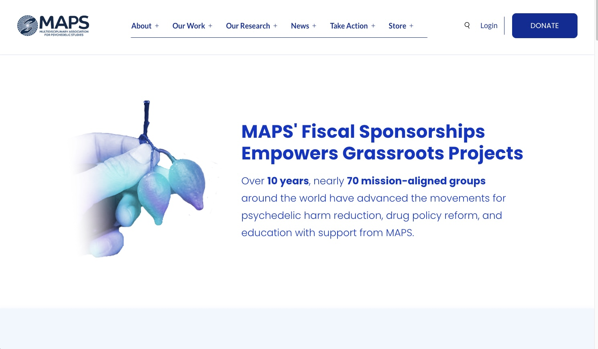

<h1 align="center">Multidiscplinary Association for Psychedelic Studies (MAPS) 🪬</h1>

## 👨‍💻 About The Project

In my current intership, I have been assigned to develop the [MAPS Fiscal Sponsorships](https://maps.org/fiscal-sponsorships/) platform, a dedicated hub for grassroots organizations to explore both [Legacy](https://maps.org/fiscal-sponsorships/legacy-projects/) and [Active](https://maps.org/fiscal-sponsorships/active-projects/) projects, as well as to facilitate effortless [Sponsorship Applications](https://maps.org/fiscal-sponsorships/get-started/). Collaborating with diverse stakeholders, we are committed to meeting cross-departmental requirements, ranging from the precise representation of projects to adeptly securing new donors, thereby fostering a vibrant and synergistic ecosystem.

## 🛠️ Built With

This application was built utilizing a collection of technologies including but not limited to:

* Wordpress
* PHP
* Javascript

## 📖 Features

* **Intuitive Landing Page**: This page serves as a central hub for Fiscal Sponsorships, intuitively categorizing and leading you to Legacy Projects, Active Projects, introductory guides, and a closer look at the MAPS community.
* **Dynamic Interactive Map**: Leveraging the Google API, an interactive map allows users to navigate seamlessly through various projects directly on the MAPS website, enhancing user engagement and experience.
* **Streamlined Application Process**: Hassle-free registration process with a straightforward application form, making signing up both quick and easy, thereby saving users valuable time.
* **User-Friendly Interface**: Experience a visually appealing and easy-to-navigate interface, designed with user convenience, brand guidelines, and enjoyment in mind, fostering a more friendly and efficient browsing experience.

## 📸 Snapshots

---

---

---

---

---

---

---

---

---

---

---

